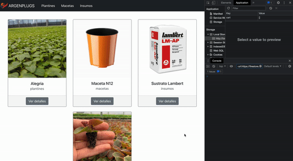

# ARGENPLUGS e-commerce

_I created this project for Coderhouse's ReactJS course with the idea of later merging it with Argenplug's (my family's business) website. This e-commerce has got 4 products within 3 categories only as an ilustrative manner, more of them can be easily added._



### Constructed using the following dependencies:

- [ReactJS](https://reactjs.org/)
React is a free and open-source front-end JavaScript library for building user interfaces based on UI components. It is maintained by Meta and a community of individual developers and companies.
- [React-Bootstrap](https://react-bootstrap.github.io/):
Helped making it easy and fast to take care of the styling, letting me focus in developing react rather than CSS.
- [Firebase](https://firebase.google.com):
Database where all products and order information is stored and accesed in real time in the app.
For future development of the database, products are required the following information:
_(ID, name, category, price, stock, img1 (square), img2 (4x1 ratio), description)_ 
The orders will be displayed with the cart items information and quantity + buyer information including:
_(Name, email, phone, address, comments)_

- [React-Router](https://reactrouter.com/docs/en/v6):
This library lets us create routes that do not renderize the full page when a children component is renderized. They are also built dinamically, facilitating the app development.

##### Routes:

``/category/:category`` Displays the products filtered by the category requested.

``/item/:itemId`` Displays the product requested by ID with all its information. From here it is possible to select a quantity and have it added to the cart.

``/cart``Displays the customer's cart. It is stored in the localStorage so there is no need for the customer to prepare it againg if the tab was closed. It also offers the possibility to modify the quantities requested.

## Local execution
Follow the next steps to check the app locally

1. Open a new terminal and clone the repository with the following command:
```
    git clone https://github.com/matias-millenaar/app-coder.git
```

2. From the terminal locate yourself in the root folder of the project and install all de dependencies: 
```
    npm install
```

3. Run the following command to initialize:
```
    npm start
```